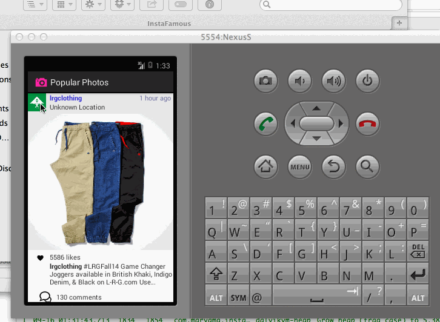

# Instafamous

This is an Andriod demo application for viewing popular photos on instagram.
Time spent: ~8 hours spent in total

Completed user stories:

 * [x] Required: User can scroll through current popular photos from Instagram.
 * [x] Required: For each photo displayed, user can see comments, profile photo relative timestamp, like count.
 * [x] Add pull-to-refresh for popular stream.
 * [x] Show all comments in a dialog.
 * [x] Resize photo while maintaining aspect ratio.
 * [x] Format text using html

Notes:
  Location feature incomplete. 
  

GIF created with [LiceCap](http://www.cockos.com/licecap/).
